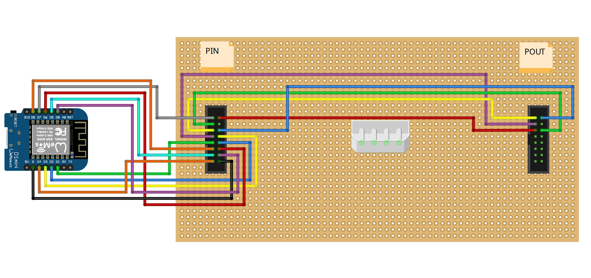

"Proyecto original de https://github.com/witnessmenow/LED-Matrix-YouTube-Sub-Display

Hace uso de la libreria:

https://github.com/2dom/PxMatrix

y tambien de la Api de Youtube del asombroso Brian Lough
https://github.com/witnessmenow

Características:

Adaptado a paneles matrix P3 de 64x64 que puedes adquirir aqui: https://s.click.aliexpress.com/e/_DmRn9VX
Compatible con paneles P2.5 de 64x32 que puedes adquirir aqui: https://s.click.aliexpress.com/e/_DCwufOD
arduino IDE precompilado y portable
Varios tamaños de logo para seleccionar (SOLO PARA PANELES DE 64X64)

